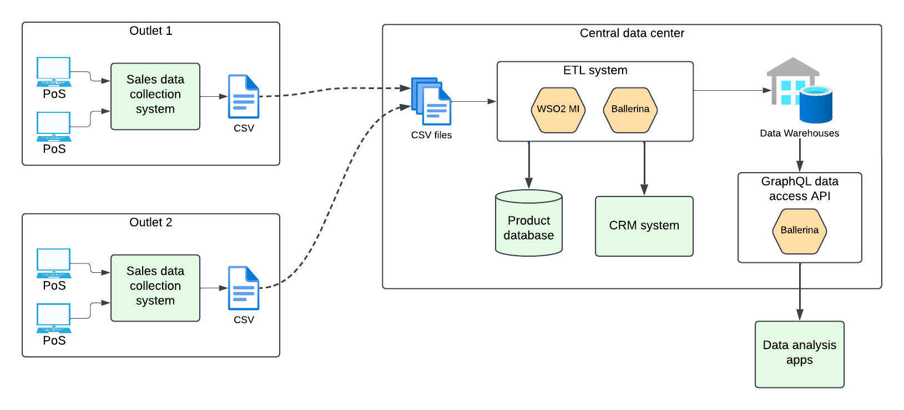

# ETL Demo - GlobalMart sales data integration

## Business use case

GlobalMart is a supermarket chain operated across multiple cities. Each GlobalMart outlet maintains records of daily sales. GlobalMart senior management needs to analyze overall sales data to identify sales trends and possible optimizations. In order to facilitate this requirement, it was decided to standardize and collect all sales data to a central storage, upon which various analyses can be performed.

## Technical problem

Each GlobalMart outlet has a sales data collection system that collects data from the PoS systems of the corresponding outlet. However, outlets in certain cities operate different PoS systems, so the captured sales data is not consistent across all outlets. Sales data collection systems in outlets can output daily sales data as CSV files.

CSV files from each outlet need to be fetched periodically (e.g. daily) to the ETL system. ETL system must perform the following tasks:

- Read CSV files from a given location
- Resolve inconsistencies in the productId field
- Fetch additional product data from a product database
- If product data is not available, write the sales record to a separate CSV file for manual inspection
- Fetch customer age from a CRM system
- Load cleansed and enriched sales data to a data warehouse

It is also necessary to expose a GraphQL API to query the sales data warehouse, which will be accessed by GlobalMart's data analytics apps.

## Solutions architecture



Sales data CSV file has the following format:
`productId, customerId, storeId, timestamp, quantity`

E.g.
```
P_102,C2,S3,2025-01-16 12:34:56,2
102,C2,S3,2025-01-16 12:34:56,10
P_016,C3,S3,2025-01-19 12:30:55,5
P_103,C105,S2,2025-01-18 12:38:56,5
```

## Implementation

### ETL flow

Each GlobalMart outlet copies daily sales CSV files to a folder in the central data center. 
WSO2 MI deployed in the central data center polls this folder periodically and starts processing available files as follows:

- A Ballerina service is called to resolve the following inconsistencies in product Ids:
    - If the "P_" prefix is missing, add the "P_" prefix.
    - Perform a map lookup to replace invalid product Ids with valid ones.
- Additional product data is fetched from the MySQL product database.
- If a product is not available in the database, the corresponding sales record is appended to the `invalid_data.csv` file.
- The REST API of the CRM system is called to fetch the customer's age.
- All fetched details are combined to form consolidated sales records.
- Consolidated sales records are written to the data warehouse.

### GraphQL API
GraphQL API is written in Ballerina. This Ballerina component queries the data warehouse and exposes the results as GraphQL.

Implementation of the complete scenario is available here.

## Demo steps

1. Install Docker and Docker Compose (if not already installed)

2. Checkout the repository.
    - MI artifacts of the ETL flow is in the <repo_home>/mi/GlobalMart folder
    - Ballerina program for standardizing product Ids is in the <repo_home>/bal/std folder
    - Ballerina program for exposing data via a GraphQL service is in the <repo_home>/bal/dataview folder
    - Sample input files are in the <repo_home>/sales_data/tests folder

3. Run <repo_home>/deploy_demo.sh to deploy the ETL demo using docker compose

4. Show the products and sales_data tables (use `mysql -h 127.0.0.1 -u root -p` to force TCP connection to the mysql server running in a container)
    - sales_data table is initially empty

5. Show the <repo_home>/sales_data/tests/data.csv file.
    - Product Id of the second record (i.e. 102) is not formatted correctly. It needs to be corrected as P_102.
    - Product Id of the third record (P_016) needs to be mapped to P_216.
    - Product Id of the fourth record (i.e. P_103) is not in the products table. Therefore, it's an invalid record.

6. Copy the <repo_home>/sales_data/tests/data.csv to the <repo_home>/sales_data/in folder.

7. ETL flow will pick the file and process it after the given interval. After reading the file, it will be deleted to avoid repeated reads.

8. Show the sales_data table. It will be filled with enriched sales data.
    - Product Id 102 is corrected as P_102
    - Product Id P_016 is mapped to P_216

9. Show the <repo_home>/sales_data/failed/invalid_data.csv file.
    - The record with the unavailable product Id (i.e. P_103) will be written to this file. 

10. Run the following command (by changing query values and field selection as needed) to invoke the GraphQL API for querying consolidated sales data.

```
curl -X POST http://localhost:8050 \
-H "Content-Type: application/json" \
-d '{
    "query": "query { sales(customer: \"C2\", store: \"S3\") { productId, customerId, storeId, customerAge } }"
}'
```
